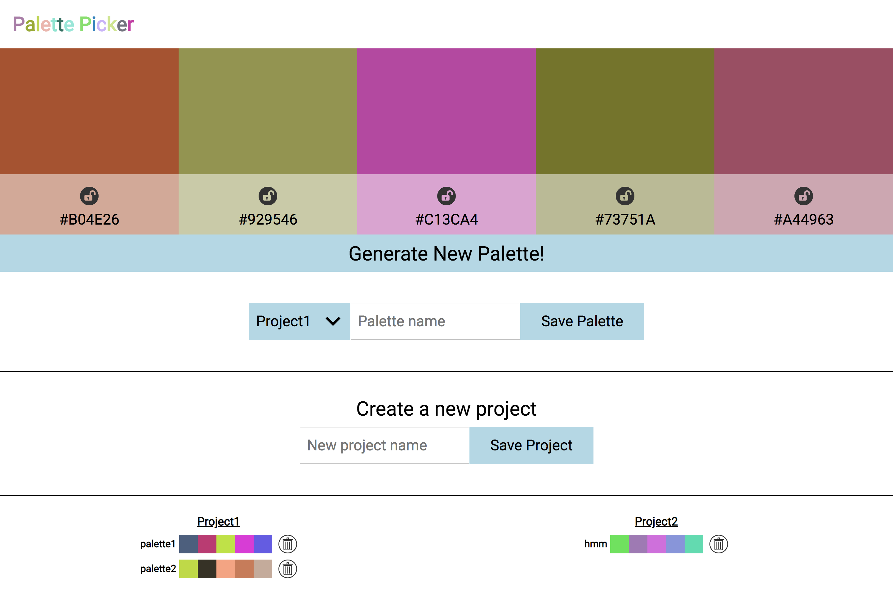

# palette-picker

Palette Picker allows you to generate color schemes and save them in project folders. It was built using jQuery, Postgress, Knex, with the API tested with moch, chai, and chai-http

### Project team:

Chase Richard [GitHub](https://github.com/hmmChase)

### Original comp:

### Final design:

## Set Up

- Clone this project

- Run `npm install` from the root directory

- Run `node server.js` and visit localhost:3000 in your browser

- Run tests with `mocha`
